# The Little Bit Queer Art Shop

This project is an online shop for an independent artist to sell their work. It is a Django project consisting of multiple apps and backed by a relational PostgreSQL database which stores user, product and order information. Payments and orders are handled by Stripe. The final project is hosted on Heroku.

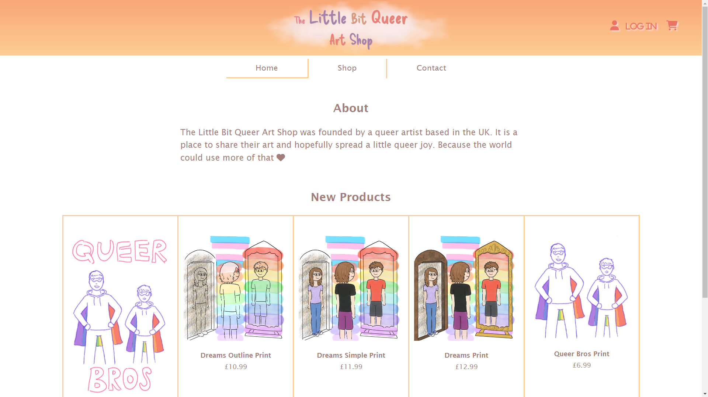

View the live project [here](https://little-bit-queer-art-shop-bed824a2914a.herokuapp.com/).

---

## UX

### User Stories

- Goals for vistors:

    - View store items and details including product image, name, description and price

    - Add items to their cart

    - Purchase items

    - Create an account
    
    - Log in and out of their account

    - View their details and past orders on their profile

- Goals for site owner

    - Promote their artwork

    - Sell their artwork for a profit

    - Manage the website and database

    - Manage products and orders

---

## Design and Planning

### Website

The layout and design of the website were first visualised using wireframes. HTML, CSS and Bootstrap were then used to recreate this design in code and build the UI of the website.

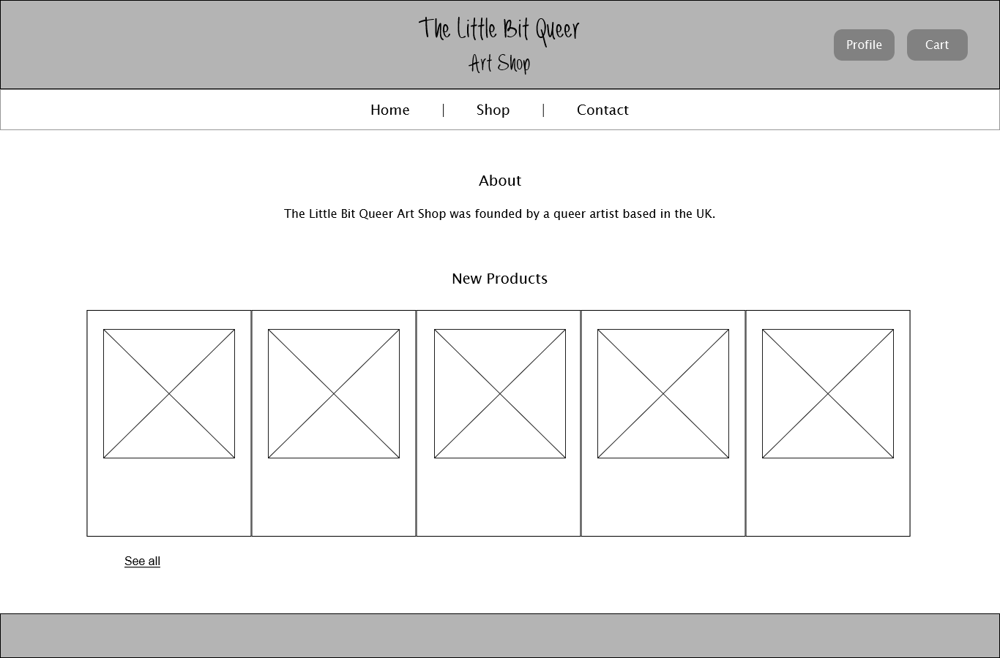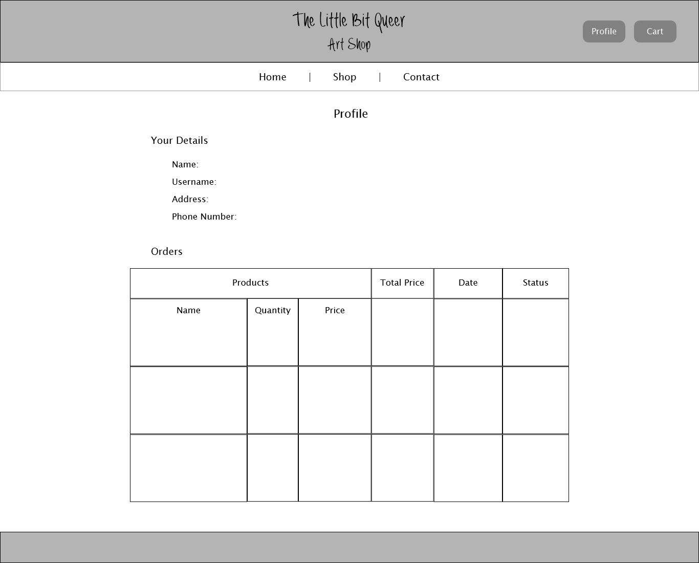
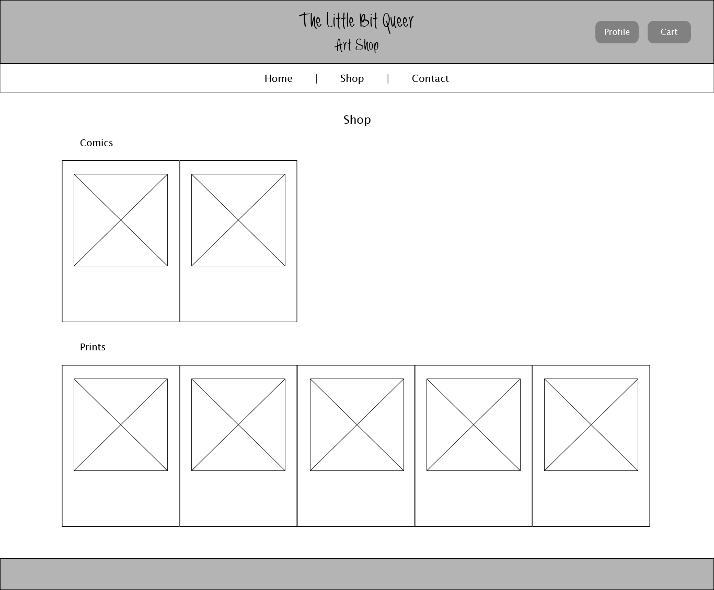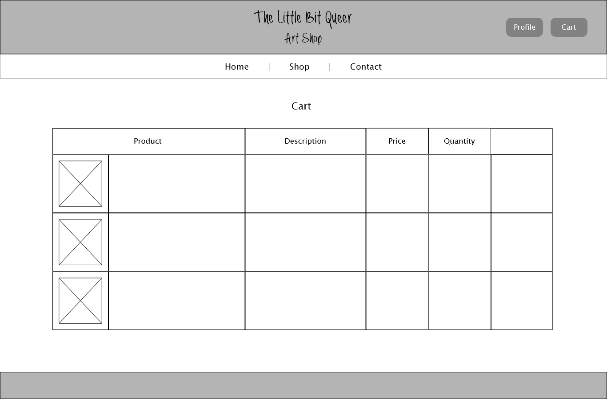

The website uses a Google font called Delicious Handrawn for the logo. I chose this font as I wanted something with a casual, hand-written feel to it, while also remaining clearly legible. Each word in the logo is also sized differently creating a ramshackle effect, which adds to this fun, playful appearance. The hand-drawn style also mirrors the hand-crafted nature of the products on offer.

The site's colour scheme uses a variety of warm pastel colours, with shades of orange, yellow, pink, purple and brown on a white background. I chose these as I wanted a warm, cosy feeling to the site, to make visitors feel at home. These colours are also easy on the eye and compliment each other well.

### Database

The database structure used in this project is fairly simple, featuring three tables - orders, products and users. These are based off the default Django models. The tables are linked together using foreign and primary keys, for instance an order will contain user and product information by referring to the relevant ID in the users and products tables. The database structure and relationship can be seen in the ERD below.

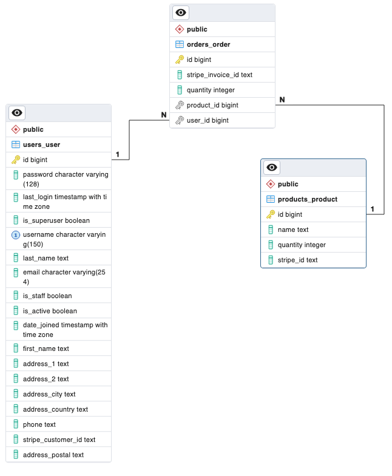

More information on how the database was set up is outlined in the [Project Structure](#project-structure---backend) section.

---

## Features

### Header, Footer and Navigation


The header of the website features the logo for the site and log in/profile and cart buttons. When not logged in, the log in/profile button shows the text 'Log In' and will take the user to the login page. Once logged in, this link will change to show the user's username and take them to their profile. The cart is also not accessible without being logged in and will redirect the user to log in first.

Beneath this is the navbar, which has links to the homepage, shop, and contact page. The current page is indicated with a line at the bottom of the tab. This line also appears when the tabs/links are hovered over, as well as the text colour changing.

At the bottom of each page is a simple footer containing social media links.


### Landing Page - About and New Products

On the landing page, visitors are met with a simple about section, which gives a brief overview of the site's origin and purpose.


Beneath this is a product gallery showing the newest products added to the shop. This is achieved by using a Fetch request to get all the products that have been added to the database through Stripe, then creating divs with the information for the five newest products and displaying these on the page. The 'See all' link below the product gallery will take the user to the shop page to view all available products.

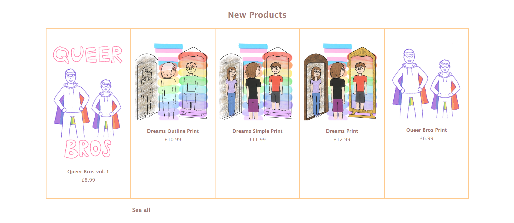

### Shop Page

The shop page shows all the products available to buy on the website, sorted into comics and prints. This is done by fetching all products from the database, then sorting them into two new arrays according to type, before building and displaying divs with the product information in each array.

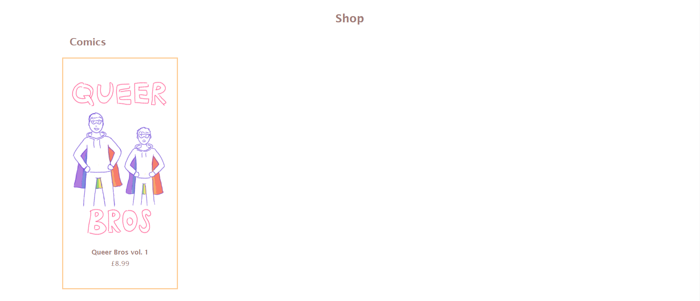

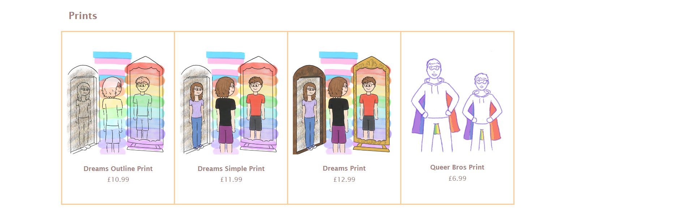

### Product Page

When the product name or image is clicked on both the home or shop pages, the user is taken to the product page, which loads in the information for the selected product from the database.

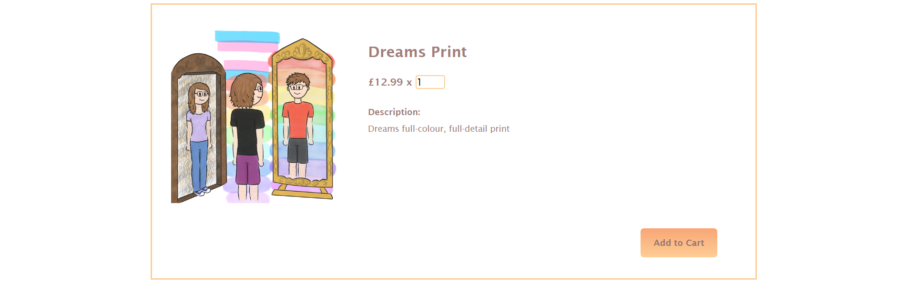

The user is able to choose a quantity of the product and add it to their cart. The 'Add to Cart' button retrieves any items already in the cart from the session storage as an array of objects, adds the new item and quantity to it, then updates the cart in session storage with the new array. The button is disabled while the product information is loading.

If the item has been successfully added, a modal is shown to indicate this to the user.


From here the user can either close the modal and continue shopping, or use the 'Go to Cart' button to view their cart and checkout.

### Cart

The cart page requires the user to be logged in; if they are not, they will be redirected to the login page before proceeding, where they can make an account if needed and then log in.

Once logged in, users will be able to view the items in their cart along with the quantity selected. This is achieved by retrieving the cart from session storage on page load and creating a table entry for each item.


If the user changes their mind about an item in their order, they can remove it from their cart with the 'Remove' button, which uses the product ID to remove the selected product from the array of objects added to session storage. Alternatively they can clear their cart entirely with the 'Clear Cart' button. The cart will also be cleared if the user closes the tab or their browser, as session storage is cleared when the session is closed.

When the user is happy with their order and ready to proceed to payment, they can click the 'Checkout' button. Both these buttons are disabled if the cart is empty.

### Stripe Checkout

The checkout button creates a Stripe checkout session, providing the price ID and quantity of the items selected in a stringified array. The user will then be able to enter their card details or use another payment method to purchase their chosen items, creating an invoice in Stripe with the order details. A webhook listens for this event and adds an order entry to the database once the order has been completed.

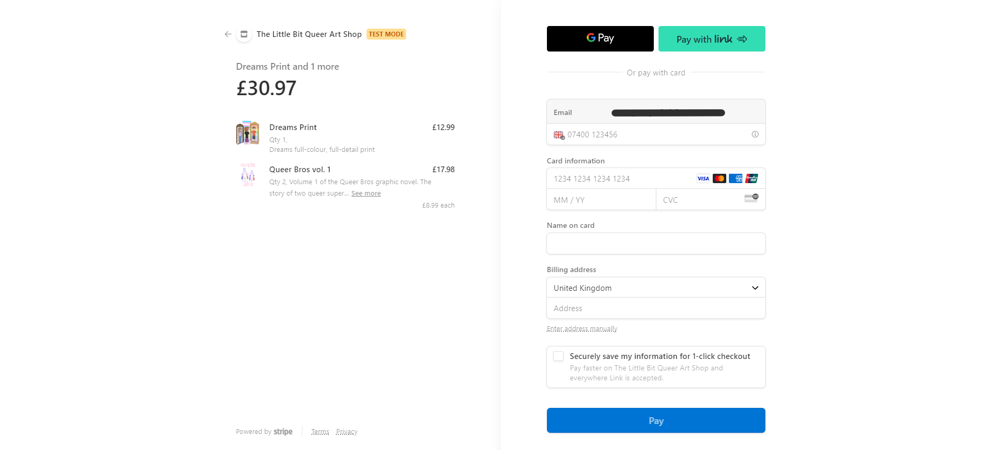

If the payment has been completed successfully, the user will be redirected to a success page - or a cancelled page if the payment was not completed. From here they can return to the site homepage.

Further information on Stripe checkout and payment handling is documented [here](#stripe-api).

### Log In, Sign Up and Profile

The website contains a simple login page requiring a username and password, which are matched to the users table in the database, and authorisation only occurs if the credentials are correct.


If a visitor does not have an account, they are also able to create one from here using the 'Sign Up' link and providing a username, email, full name and password, which have to meet certain criteria to be accepted. This form uses Django's template sign up form as a basis. Once the criteria are met, the new user is added to the database and they are able to log in to their account.

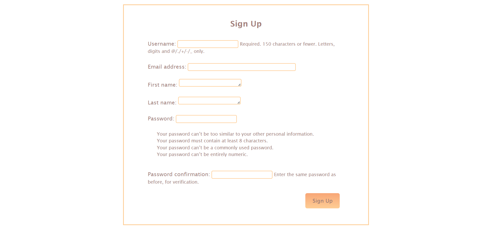

Once logged in, the user can visit their profile, which shows their personal details as supplied when they signed up or made a purchase, and a table containing their order history, including the price, date and status of the purchase, with the newest orders shown first.

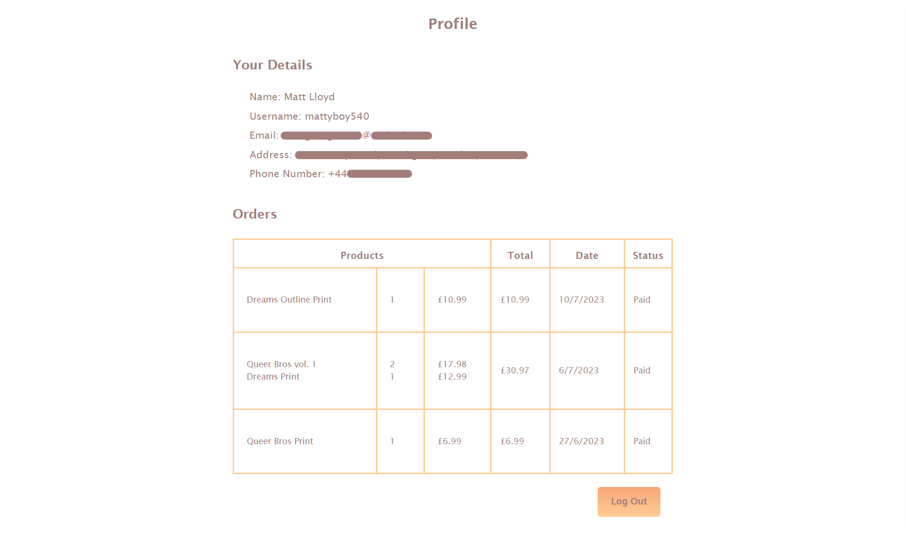

These orders are retrieved from the database using the current user's username to get all past orders linked to their account. Duplicate invoice IDs are removed and the remaining orders are sorted according to date created. The desired order and product information is then pulled from the invoice and displayed in the table.

There is also a button to log out of their account.

### Contact Page

Finally, there is a simple contact page which shows the contact details and social media links for the shop.


### Improvements and Features to Add

- A nice feature to add would be to have the app send a confirmation email to the customer when an order has been placed. This was a feature I looked at adding but didn't have time to implement in the end.
- It would also be nice to have a more customised sign up form rather than using the default Django one, but I have not been able to do this yet, beyond adding my custom styling to the page and form, as I had to prioritise focus on other areas of the site.
- Currently it is possible to add multiple instances of the same item to the cart, as they are not recognised as being duplicates of the same item. This also reveals a drawback with the way the 'Remove' button works, as it uses the product ID and therefore removes all instances of the product from the cart instead of just the one selected. Ideally, to avoid this, I would add some logic to check whether the item being added already exists in the cart, and if so, the item should not be added again and instead the new quantity of the product should be added to the existing quantity. This issue was only noted towards the end of the build however so there was not time to implement this.
- The site is not fully responsive in its current state; this is another improvement I would've added given more time (see [below](#responsiveness) for more detail).

---

## Project Structure - Backend

### Database and Application Layout

The backend design for this project was relatively straightforward due to a combination of factors, primarily the lack of need for a complex data structure due to both Django and Stripe helping with data management.

The project is split up into 3 main Django applications: Users, Products and Orders. Each of these contains a models.py file to define itself in the database, as well as any associated Django views in the respective views.py file within each application folder. URL routing information for each is also stored in the urls.py file, mapping both API routes and HTML page routes to Python functions in the views.py file. A fourth Django application, Home, is used for the Home, Shop and Cart page views but does not need to contain any model data or backend logic outside of showing template views.

Looking at the database structure, both the orders and products models inherit from the standard Django models class, providing the correct data types as well as an ID field out of the box. For products, only two extra fields were required, a stripe_id string field containing the ID of the product in the Stripe platform, and an integer to track quantity left of a product. Orders are a little more complex, containing foreign key references to products and users so that a row entry is made per customer per order of a specific product. The Stripe invoice ID is also stored in the orders table so I can look up further information on the transaction.

The users table works a little differently as it extends from the Django auth abstract user class as opposed to the Django models class. By extending from an abstract user class, not only are a number of user-centric columns provided already (username, password, email etc.) but also all user authentication is handled for me, significantly reducing development time.

Once I had created these models, I ran the following command to generate the required SQL migration code to recreate the models as tables in the database:

```
python3 manage.py makemigrations
```

This was followed by another command to execute the migrations on the PostgreSQL server to create the tables:

```
python3 manage.py migrate
```

For each model change, I have to run these commands again to ensure the changes are reflected in the database. Past migrations can be seen in the migrations folder within each Django application.

I chose to use PostgreSQL for the project due to its ability to easily handle relational data, as well as providing good compatibility with Django using the psycopg2 pip package which is natively supported (albeit with a couple of tweaks to the database connection code in the settings.py file).


### Stripe API

Using the Stripe pip package, the project interacts with the Stripe platform to fetch product information as well as process payments and create invoices for orders. As mentioned above, each product stores a Stripe product ID which is generated when a product is created in the Stripe dashboard. By storing this ID, I can use the Stripe API to look up further information on each product, avoiding the need to store product information such as name, description, price and associated images in my own database.

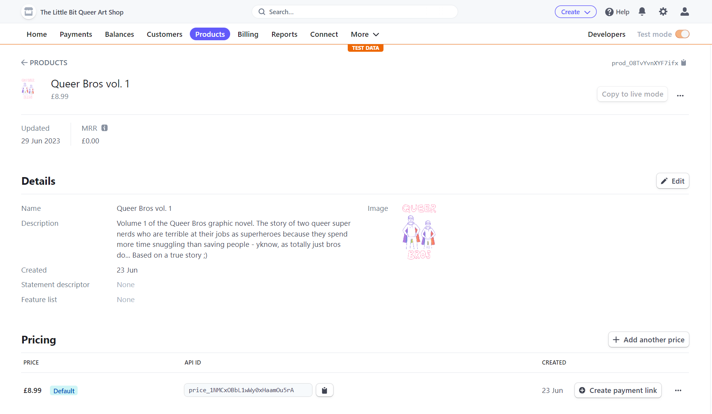

There are two methods to look up product information: `get_product` to fetch a specific product using its internal database ID, and `get_all_products` to fetch all products (e.g. on the home page). On product fetch, I look up the product in the PostgreSQL database using the ID supplied and get the Stripe product ID as well as the quantity left. I then use this to query the Stripe API, returning more information on the product as well as pricing information. I then combine the two and return the merged object to the frontend to display. This can be seen in the /products/views.py file which contains both methods.

Stripe payment logic is handled within the orders application, and is a combination of JavaScript frontend logic to establish a Stripe session and redirect to the Stripe payment page, and a backend route to create the checkout session via the Stripe API. When the 'Checkout' button is clicked on the cart page, all purchased items are sent to the /orders/config route as an array of Stripe price ID and quantity desired. These are the only values the Stripe API needs to know from the ordered products as, internally, it can use the price ID to look up the full product information. Providing a valid Stripe session has been created, and the /orders/config route has successfully created a checkout session with Stripe, a URL for the client browser to redirect to is sent back to the page, and is provided to the `stripe.redirectToCheckout()` JavaScript method, forcing the client browser to redirect to the Stripe payment page.

Following a successful payment, two key things happen. Firstly, Stripe generates an invoice record containing customer details and information on which products were purchased. Secondly, I have set up a webhook within /orders/views.py which listens to an endpoint created in the Stripe developer area for any events of the type `invoice.payment_succeeded`. If such an event is received, I parse the returned invoice object for both customer data captured on the payment form, in order to update my user record in the database with any new information entered on the payment page (e.g. address, phone number etc.), as well as to cycle through the products purchased to reduce the relevant quantity value in the database. This allows me to keep track of stock inventory, which is not possible by Stripe alone (it has no concept of stock, only what a product is).

---

## Technologies

### Languages

- HTML5
- CSS3
- JavaScript
- Python + Django
- SQL (PostgreSQL)

### Frameworks, Libraries, Programs, APIs, External Stylesheets

- [Stripe](https://stripe.com/gb) for handling products, payments and orders
- [Git](https://git-scm.com/) for version control
- [GitHub](https://github.com/) to store the project repository and back up git commits
- [Bootstrap v5.3](https://getbootstrap.com/docs/5.3/getting-started/introduction/) to assist in creating the structure and design of the webpages
- [Google Fonts](https://fonts.google.com/) for the logo font
- [Font Awesome](https://fontawesome.com/) for the social media, cart, user and heart icons
- [Justinmind](https://www.justinmind.com/) to create the wireframes
- [Clip Studio Paint](https://www.clipstudio.net/en/) to create the artwork and cloud for the logo

---

## Testing

### User Experience

My project was thoroughly tested by myself and others throughout its development to ensure that all aspects of the application work as intended.

Site Function
- All navigation links/buttons have been tested to ensure they go to the correct locations and there are no broken links.
- 'Add to Cart' button correctly adds the selected product and quantity to the cart. There used to be a bug where, if the cart had not been initialised by visiting the cart page, or reinitialised after clearing the cart, it would throw an error when trying to add items. To fix this I made sure the cart was properly re-updated after clearing items, and added some logic to the `addItemToCart()` function to check whether the cart is undefined after getting it from session storage; if so, it is set to an empty array, allowing new items to be added.
- Users can only supply a number value for the quantity and cannot add items to their cart if the quantity is empty, less than 1, greater than 10 or not a whole number. Originally it was possible to add items to your cart with any number value inluding 0 or non-integers, or leave the field empty, which would then cause an error when attempting to checkout. To prevent this I added some logic to parse the quantity value as an integer (stripping off any decimal points), and then check whether the resulting integer is between 1 and 10; if not, an alert is flashed informing the user of the problem.
- 'Clear Cart' button successfully removes all items from the cart.
- 'Remove' button removes selected product from the cart (though if there are duplicates of a product it will remove all instead of just the selected one - as noted [above](#improvements-and-features-to-add)).
- Checkout button creates a Stripe checkout session and redirects the user.

Data Retrieval
- Products displayed on the home and shop pages show the correct information retrieved from Stripe and the database, including product name, image, description and price.
- When a product link is clicked, the following page loads in the data from the selected product correctly.
- The logged in user's past orders are correctly displayed on their profile with no duplicates or other user's orders. Originally duplicate orders were being displayed if there were multiple items in an order, as each item is stored in the database as a separate order with the same invoice ID. To avoid this I added some logic to filter the orders and remove any with duplicate invoice IDs so each order is only shown once.

Authorisation and Security
- Log in succeeds if user credentials matching a user in the database are corrected inputted, and fails if credentials do not match.
- Logged in users are shown a link to their profile with their username; visitors are shown a link to log in. The profile page redirects the user to the login page if they are not logged in to avoid users being able to access this page without being logged into an account.
- Users are able to successfully create an account using the sign up form.
- Users are required to be logged in to buy items, so attempts to access the cart page while not logged in bounce the user to the login page. Originally users were able to access the cart page before logging in which would then cause an error if they attempted to checkout, so as part of testing I made login required for this page.
- Log out button logs current user out successfully.
- No plain text passwords are stored in the database to avoid exposing sensitive information.

Stripe Checkout
- Stripe checkout shows the correct items and quantities being purchased from the user's cart.
- Payment is successfully completed when tested using Stripe's test card number.
- Stripe webhook functions to add orders to the database once payment has been completed. This feature was initially broken on the live site, which turned out to be due to a typo when the environment variables were added to Heroku, and has now been rectified.

### Responsiveness

Due to time constraints on this project, I have not been able to make the website fully responsive, as I had to focus my efforts on the functionality of the site and the payment system itself. However I have used Bootstrap's grid feature and breakpoints to improve the reponsiveness, so most aspects of the site resize according to the screen size, making the app useable across a variety of devices. Unfortunately though there are still some elements such as the fonts and tables that don't scale as well, becoming too large/small on mobile, and the menu options become stacked and take up quite a lot of screen space. Given more time I would've liked to make the site fully responsive and add a collapsible menu bar to improve the user experience for mobile users, and I hope to implement this in the future.

### Compatibility

The app has been tested on a variety of internet browsers to ensure compatibility. No compatibility issues have been found on Google Chrome, Microsoft Edge, Mozilla Firefox or Safari and the app works well and looks good on all these browsers.

### Validation

All pages of the website were passed through the [W3C validator](https://validator.w3.org/) via their URI and no issues were found.

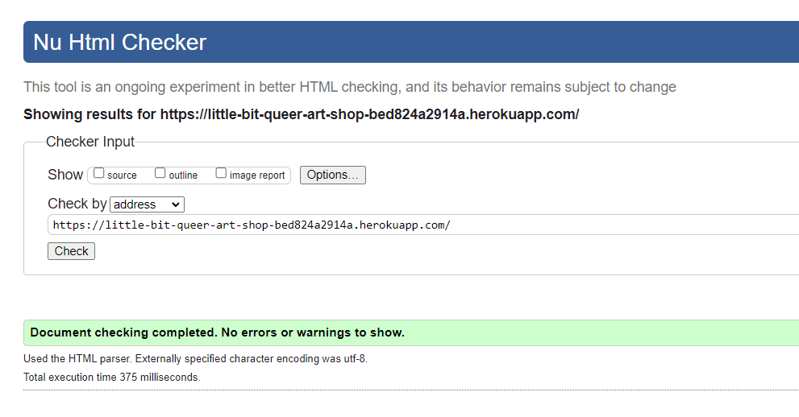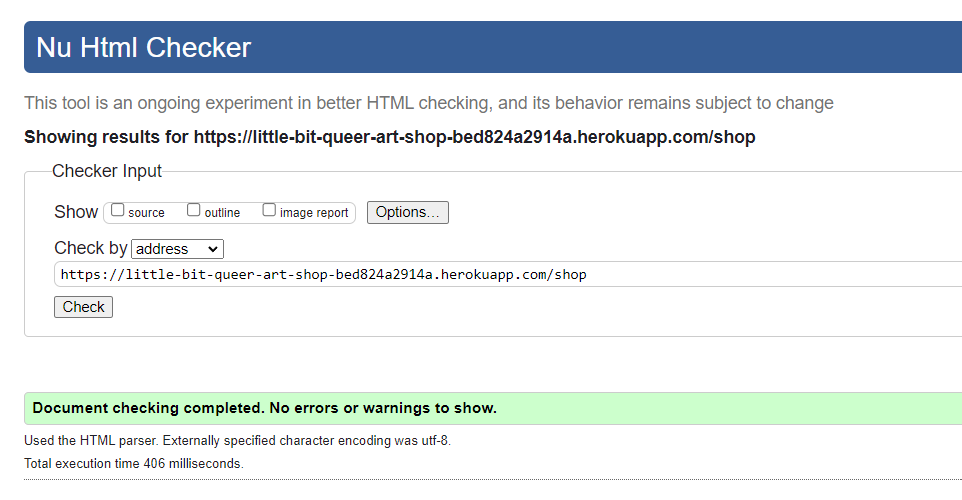
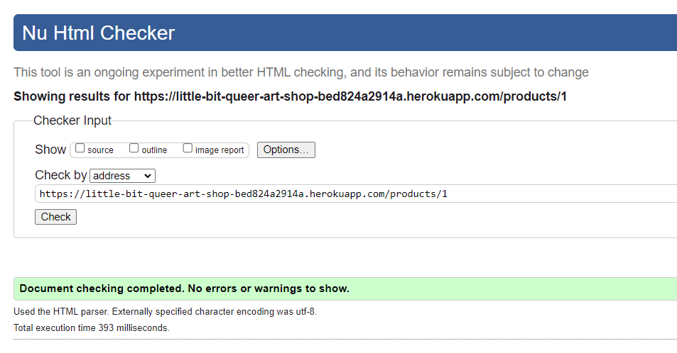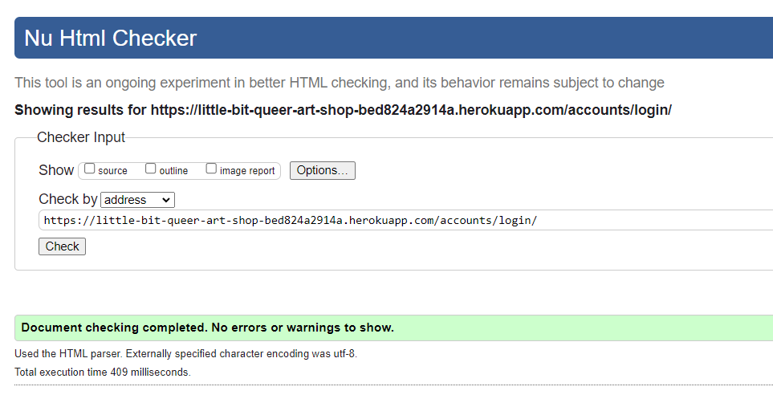

CSS was passed through the [Jigsaw validator](https://jigsaw.w3.org/css-validator/) by direct input and no issues were found.

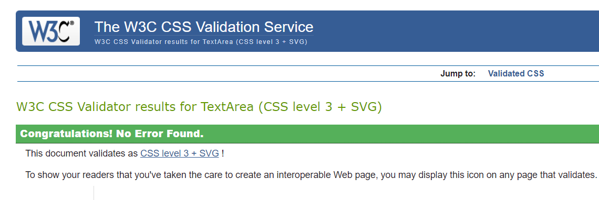

### Accessibility

[WAVE](https://wave.webaim.org/) was used to assess the accessbility of the website and no errors or alerts were given. It did flag up some issues with empty links, which I corrected by adding ARIA labels to these to assist screen reader users. Some contrast errors were found, however I was unable to rectify these without negatively affecting the look and feel of the site.

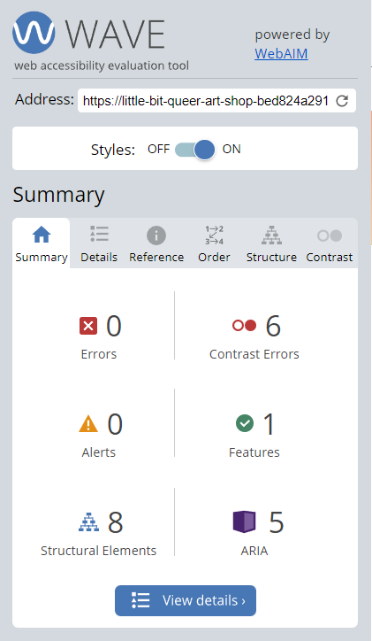

### Known Bugs

There seems to be an issue if the name supplied to Stripe when making a purchase does not match exactly with the name on the account in the database.

---

## Deployment

The final project has been deployed to Heroku using a continuous delivery (CD) pipeline. This is linked up to the project repository on GitHub, meaning that whenever new code is committed and pushed to the main branch, Heroku automatically builds a new version of the app using this code and deploys it. As I am the only developer working on this project, I have been committing my work directly into the main branch, however for most projects it would be preferable to work in a separate branch and then create a pull request to merge changes into main once they have been tested.

The application currently runs on one dyno. In the future, this could be improved by using two dynos, one building automatically from a development branch, and the main one being manually updated once development has been fully tested. Automatic continuous integration (CI) testing could also be implemented so that builds are tested before Heroku attempts deployment, to prevent bugs or errors being deployed into the live site.

To forward web requests from the client to the Django application, a web server gateway interface is required. As recommended by Heroku, I have used Gunicorn to handle web request forwarding, with this being configured in the Procfile.

HTTPS has been enabled using the automatic SSL certificate setting within Heroku, to ensure that connections to the website are encrypted.

All pip packages that are required to be installed in order to run the application are supplied in the requirements.txt file, allowing Heroku to install all the relevant packages when building the app. Heroku also automatically runs a `collectstatic` command when building the app to collect all static files (CSS, JavaScript and images) from their individual directories within applications (listed in settings.py) and add them to one static folder, in order to allow these to be loaded correctly in the deployed site.

The database has been deployed using migrations, as mentioned in the [Database and Application](#database-and-application-layout) section. 

---

## Credits

### Code

I referred to the [Django docs](https://docs.djangoproject.com/en/4.2/intro/tutorial01/) to help when setting up my project, as well as this [guide](https://www.enterprisedb.com/postgres-tutorials/how-use-postgresql-django) to help with connecting this to the database.

I used this [guidance from Heroku](https://devcenter.heroku.com/articles/django-app-configuration) to help when trying to deploy my Django app.

I used these [docs on WhiteNoise](https://whitenoise.readthedocs.io/en/stable/django.html) to help configure my app for production when there were issues accessing static files.

### Content and Media

All written content on the website was created by myself.

All images used on the site and for the products were designed and created by myself using digital art software.

[Google fonts](https://fonts.google.com/) for the logo font and [Font Awesome](https://fontawesome.com/) for the icons.
