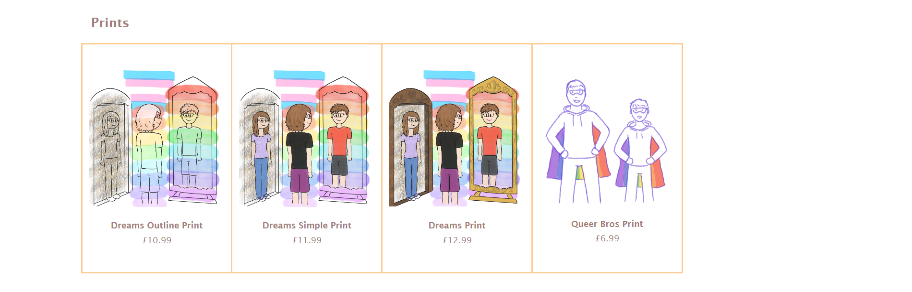

# The Little Bit Queer Art Shop

This project is an online shop for an independent artist to sell their work. It is a Django project consisting of multiple apps and backed by a relational PostgreSQL database which stores user, product and order information. Payments and orders are handled by Stripe. The final project is hosted on Heroku.

View the live project [here](https://little-bit-queer-art-shop-bed824a2914a.herokuapp.com/).

---

## UX

### User Stories

- Goals for vistors:

    - View store items and details including product image, name, description and price

    - Add items to their cart

    - Purchase items

    - Create an account
    
    - Log in and out of their account

    - View their details and past orders on their profile

- Goals for site owner

    - Promote their artwork

    - Sell their artwork for a profit

    - Manage the website and database

    - Manage products and orders

---

## Features

### Header, Footer and Navigation

The header of the website features the logo for the site and log in/profile and cart buttons. When not logged in, the log in/profile button shows the text 'Log In' and will take the user to the login page. Once logged in, this link will change to show the user's username, and take them to their profile when clicked. The cart is also not accessible without being logged in and will redirect the user to log in (or make an account) first.

Beneath this is the navbar, which has links to the homepage, shop, and the contact page. The current page is indicated with a line at the bottom of the tab. This line also appears when the tabs are hovered over, as well as the text colour changing when the links are hovered over.

At the bottom of each page is a simple footer containing social media links.

### Landing Page - About and New Products

On the landing page, visitors are met with a simple about section, which gives a brief overview of the site's origin and purpose.

Beneath this is a product gallery showing the newest products that have been added to the shop. This is achieved by using a Fetch request to get all the products that have been added to the database through Stripe, then creating divs with the information for the five newest products and displaying these on the page. The 'See all' link below the product gallery will take the user to the shop page to view all the available products.

### Shop Page

### Product Page

### Cart

### Stripe Checkout

### Log In, Sign Up and Profile

### Contact Page

### Improvements and Features to Add

- A nice feature to add would be to have the app send out a confirmation email to the customer when an order has been placed. This was a feature I looked at adding but didn't have time to implement in the end.
- It would also be nice to have a more customised sign up form rather than the default Django one, but I had to prioritise focus on other aspects on the app's design.

---

## Design and Planning

### Website

The layout and design of the website were first visualised using wireframes. HTML, CSS and Bootstrap were then used to recreate this design in code and build the UI of the website.

### Database

---

## Technologies

### Languages

- HTML5
- CSS3
- JavaScript
- Python + Django
- SQL (PostgreSQL)

### Frameworks, Libraries, APIs, External Stylesheets

- [Stripe](https://stripe.com/gb) for handling products, payments and orders
- [Git](https://git-scm.com/) for version control
- [GitHub](https://github.com/) to store the project repository and back up git commits
- [Bootstrap v5.3](https://getbootstrap.com/docs/5.3/getting-started/introduction/) to assist in creating the structure and design of the webpages
- [Google Fonts](https://fonts.google.com/) for the logo font
- [Font Awesome](https://fontawesome.com/) for the social media, cart, user and heart icons
- [Justinmind](https://www.justinmind.com/) to create the wireframes
- [Clip Studio Paint](https://www.clipstudio.net/en/) to create the artwork and cloud for the logo

---

## Testing

### User Experience

My project was tested by myself and others throughout its development to ensure that all aspects of the application work as intended.

- All navigation links/buttons have been tested to ensure they go to the correct locations
- Products displayed on the home and shop pages show the correct information retrieved from Stripe and the database
- When a product link is clicked, the following page loads in the data from the selected product correctly
- Add to cart button adds the selected product and quantity to the cart, though there is sometimes a bug if the cart has not been correctly cleared (see known bugs below)
- As users are required to be logged in to buy items, attempts to access the cart page while not logged in bounce the user to the log in page. Originally users were able to access the cart page before logging in which would then cause an error if they attempted to checkout, so as part of testing I rectified this.
- The profile page also redirects the user to the login page if they are not logged in to avoid users being able to access this page without being logged into an account.
- The logged in user's past orders are correctly displayed on their profile with no duplicates or other user's orders
- Log out button logs current user out successfully
- No plain text passwords are stored in the database to avoid exposing sensitive information

### Responsiveness

### Validation

### Accessibility

### Known Bugs

There is sometimes a bug with the cart where if the cart page has not been refreshed after clearing items, it throws an error when trying to add items to the cart again. To minimise this I added a line in the `clearCart()` function to force reload the page after clearing, however I still haven't solved the original bug so it might be possible to still encounter this error when trying to add to the cart.

---

## Deployment

---

## Credits

### Code

I referred to the [Django docs](https://docs.djangoproject.com/en/4.2/intro/tutorial01/) to help when setting up my project, as well as this [guide](https://www.enterprisedb.com/postgres-tutorials/how-use-postgresql-django) to help with connecting this to the database.

I used this [guidance from Heroku](https://devcenter.heroku.com/articles/django-app-configuration) to help when trying to deploy my Django app.

### Content and Media

All written content and images used on the website and products were created by myself.

[Google fonts](https://fonts.google.com/) for the logo font and [Font Awesome](https://fontawesome.com/) for the icons
