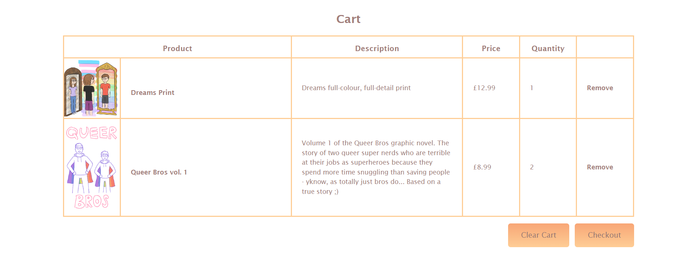

# The Little Bit Queer Art Shop

This project is an online shop for an independent artist to sell their work. It is a Django project consisting of multiple apps and backed by a relational PostgreSQL database which stores user, product and order information. Payments and orders are handled by Stripe. The final project is hosted on Heroku.

View the live project [here](https://little-bit-queer-art-shop-bed824a2914a.herokuapp.com/).

---

## UX

### User Stories

- Goals for vistors:

    - View store items and details including product image, name, description and price

    - Add items to their cart

    - Purchase items

    - Create an account
    
    - Log in and out of their account

    - View their details and past orders on their profile

- Goals for site owner

    - Promote their artwork

    - Sell their artwork for a profit

    - Manage the website and database

    - Manage products and orders

---

## Features

### Header, Footer and Navigation

The header of the website features the logo for the site and log in/profile and cart buttons. When not logged in, the log in/profile button shows the text 'Log In' and will take the user to the login page. Once logged in, this link will change to show the user's username, and take them to their profile when clicked. The cart is also not accessible without being logged in and will redirect the user to log in (or make an account) first.

Beneath this is the navbar, which has links to the homepage, shop, and the contact page. The current page is indicated with a line at the bottom of the tab. This line also appears when the tabs are hovered over, as well as the text colour changing when the links are hovered over.

At the bottom of each page is a simple footer containing social media links.

### Landing Page - About and New Products

On the landing page, visitors are met with a simple about section, which gives a brief overview of the site's origin and purpose.

Beneath this is a product gallery showing the newest products that have been added to the shop. This is achieved by using a Fetch request to get all the products that have been added to the database through Stripe, then creating divs with the information for the five newest products and displaying these on the page. The 'See all' link below the product gallery will take the user to the shop page to view all the available products.

### Shop Page

The shop page shows all the products available to buy on the website, sorted into comics and prints. This is done by Fetching all products from the database, then sorting them into two new arrays according to type, before building divs from the information in the arrays and displaying them to the page.

### Product Page

When the product name or image is clicked on both the home or shop pages, the user is taken to the product page, which then loads in the information for the selected product from the database.

The user is able to choose a quantity of the product and add it to their cart with the 'Add to Cart' button. This button retrieves any items already in the cart from the session storage as an array of objects, adds the new item and quantity to it, then updates the cart in session storage with the new array of product objects. The button is disabled while the product information is loading.

If the item has been successfully added, a modal is shown to indicate this to the user.

From here the user can either close the modal and continue adding to their cart, or press the 'Go to Cart' button to view their cart and checkout.

### Cart

The cart page requires the user to be logged in; if they are not, they will be redirected to the login page before proceeding, where they can make an account if not signed up or log in if they are.

Once logged in, users will be able to view the items in their cart along with the quantity selected. This is achieved by retrieving the cart from session storage on page load and creating a table entry for each item.

If the user changes their mind about any items in their order, they can remove an item from their cart with the 'Remove' button, which uses the product ID to remove the selected product from the array of objects added to session storage. Alternatively they can clear their cart entirely with the 'Clear Cart' button. The cart will also be cleared if the user closes the tab or their browser, as session storage is cleared when the session is closed.

When the user is happy with their order and ready to proceed to payment, they can click the 'Checkout' button. Both these buttons are disabled if the cart is empty.

### Stripe Checkout

When clicked, the checkout button will create a Stripe checkout session, providing the price ID and quantity of the items selected in a stringified array. The user will then be able to enter their card details or use another payment method to purchase their chosen items, creating an invoice in Stripe with the order details. A webhook listens for this event and adds an order entry to the database once payment has been completed successfully.

If the payment has been completed successfully, the user will be redirected to a success page to inform them of this - or alteratively a cancelled page if the payment was not completed. From here they can return to the site homepage.

### Log In, Sign Up and Profile

The website contains a simple login page requiring a username and password, which are matched to the users table in the database, and authorisation only occurs if the credentials are correct. If a visitor does not have an account, they are also able to create one from here using the 'Sign Up' link and providing a username, email, full name and password, which have to meet certain criteria to be accepted. Once the criteria are met, the new user is added to the database and they are able to log in to their account.

Once logged in, the user can visit their profile, which shows their personal details as supplied when they signed up or made a purchase, and a table containing their order history, including the price, date and status of the purchase, with the newest orders shown first.

There is also a button to log out of their account.

### Contact Page

Finally, there is a simple contact page which shows the contact details and social media links for the shop.

### Improvements and Features to Add

- A nice feature to add would be to have the app send out a confirmation email to the customer when an order has been placed. This was a feature I looked at adding but didn't have time to implement in the end.
- It would also be nice to have a more customised sign up form rather than the default Django one, but I had to prioritise focus on other aspects on the app's design.
- Currently is it possible to add multiple instances of the same item to the cart, as they are not recognised as being duplicates of the same item. This also reveals a drawback with the way the 'Remove' button works, as it uses the product ID and therefore removes all instances of the product from the cart instead of just the one selected. Ideally, to avoid this, I would add some logic to check whether the item being added already exists in the cart, and if so, the item should not be added again and instead the new quantity of the product should be added to the existing quantity. This issue was only noted towards the end of the build however so there has not yet been time to implement this.

---

## Design and Planning

### Website

The layout and design of the website were first visualised using wireframes. HTML, CSS and Bootstrap were then used to recreate this design in code and build the UI of the website.

### Database

---

## Technologies

### Languages

- HTML5
- CSS3
- JavaScript
- Python + Django
- SQL (PostgreSQL)

### Frameworks, Libraries, APIs, External Stylesheets

- [Stripe](https://stripe.com/gb) for handling products, payments and orders
- [Git](https://git-scm.com/) for version control
- [GitHub](https://github.com/) to store the project repository and back up git commits
- [Bootstrap v5.3](https://getbootstrap.com/docs/5.3/getting-started/introduction/) to assist in creating the structure and design of the webpages
- [Google Fonts](https://fonts.google.com/) for the logo font
- [Font Awesome](https://fontawesome.com/) for the social media, cart, user and heart icons
- [Justinmind](https://www.justinmind.com/) to create the wireframes
- [Clip Studio Paint](https://www.clipstudio.net/en/) to create the artwork and cloud for the logo

---

## Testing

### User Experience

My project was thoroughly tested by myself and others throughout its development to ensure that all aspects of the application work as intended.

Site Function
- All navigation links/buttons have been tested to ensure they go to the correct locations and there are no broken links
- 'Add to Cart' button correctly adds the selected product and quantity to the cart, though there is sometimes a bug if the cart has not been correctly cleared (see known bugs below)
- 'Clear Cart' button successfully removes all items from the cart
- 'Remove' button removes selected product from the cart (though if there are duplicates of a product it will remove all instead of just the selected one - as noted above)
- Checkout button creates a Stripe checkout session and redirects the user

Data Retrieval
- Products displayed on the home and shop pages show the correct information retrieved from Stripe and the database, including product name, image, description and price
- When a product link is clicked, the following page loads in the data from the selected product correctly
- The logged in user's past orders are correctly displayed on their profile with no duplicates or other user's orders. Originally duplicate orders were being displayed if there were multiple items in an order, as each item is stored in the database as a separate order with the same invoice ID. To avoid this I added some logic to filter the orders and remove any with duplicate invoice IDs so each order is only shown once.

Authorisation and Security
- Log in succeeds if user credentials matching a user in the database are corrected inputted, and fails if credentials do not match
- Logged in users are shown a link to their profile with their username; visitors are shown a link to log in. The profile page redirects the user to the login page if they are not logged in to avoid users being able to access this page without being logged into an account.
- Users are able to successfully create an account using the sign up form
- Users are required to be logged in to buy items, so attempts to access the cart page while not logged in bounce the user to the login page. Originally users were able to access the cart page before logging in which would then cause an error if they attempted to checkout, so as part of testing I made login required for this page.
- Log out button logs current user out successfully
- No plain text passwords are stored in the database to avoid exposing sensitive information

Stripe Checkout
- Stripe checkout shows the correct items and quantities being purchased from the user's cart
- Payment is successfully completed when tested using Stripe's test card number
- Stripe webhook functions to add orders to the database once payment has been completed. This feature was initially broken on the live site, which turned out to be due to a typo when the environment variables were added to Heroku, and has now been rectified.

### Responsiveness

### Validation

### Accessibility

### Known Bugs

There is sometimes a bug with the cart where if the cart page has not been refreshed after clearing items, it throws an error when trying to add items to the cart again. To minimise this I added a line in the `clearCart()` function to force reload the page after clearing, however I still haven't solved the original bug so it might be possible to still encounter this error when trying to add to the cart.

There seems to be an issue if the name supplied to Stripe when making a purchase does not match exactly with the name in the database.

---

## Deployment

---

## Credits

### Code

I referred to the [Django docs](https://docs.djangoproject.com/en/4.2/intro/tutorial01/) to help when setting up my project, as well as this [guide](https://www.enterprisedb.com/postgres-tutorials/how-use-postgresql-django) to help with connecting this to the database.

I used this [guidance from Heroku](https://devcenter.heroku.com/articles/django-app-configuration) to help when trying to deploy my Django app.

### Content and Media

All written content and images used on the website and products were created by myself.

[Google fonts](https://fonts.google.com/) for the logo font and [Font Awesome](https://fontawesome.com/) for the icons
